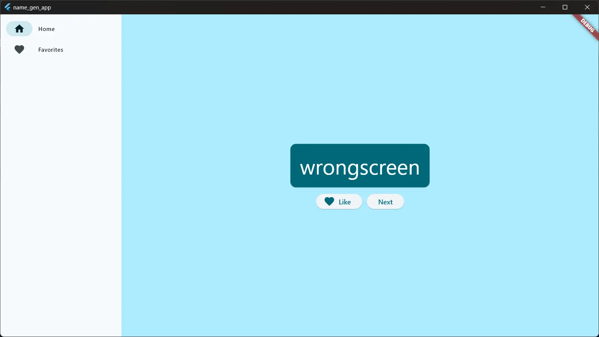
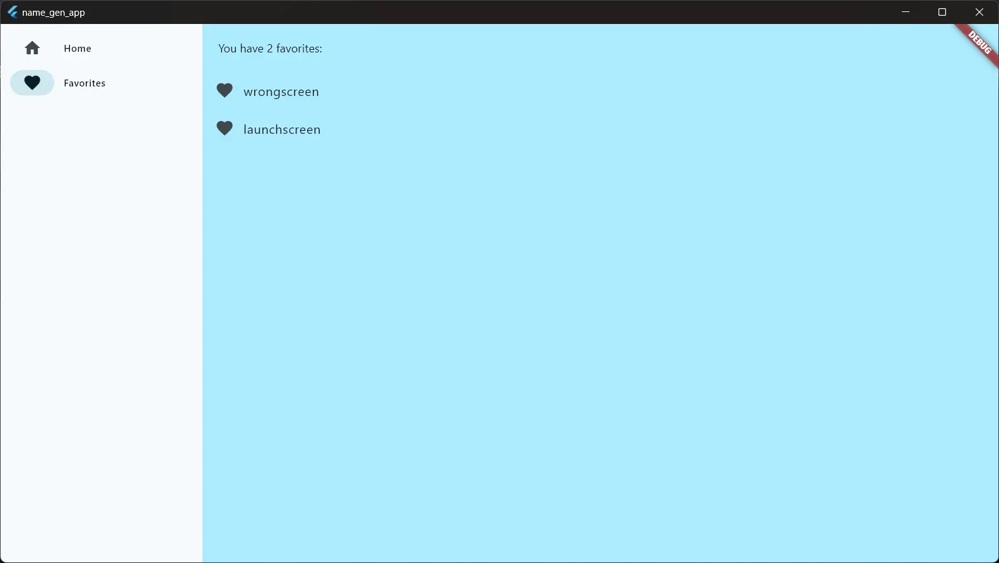

# name_gen_app

A new Flutter project.

## Name Gen App in Flutter

This is an app that generates 2 random words and adds them together to create a name,

It has a favorites option so that liked words can be stored

### Instructions

Once repo is cloned if running debug in VSCode causes a CMakeError,
run `flutter clean` and then `flutter build <operating system>` in the VSCode terminal
(since I run windows, it would be "flutter build windows" but other options could be 'macos, android, linux etc.' not sure, since I said I run windows)

### Screenshots

### Getting Started

This project is a starting point for a Flutter application.

A few resources to get you started if this is your first Flutter project:

- [Lab: Write your first Flutter app](https://docs.flutter.dev/get-started/codelab)
- [Cookbook: Useful Flutter samples](https://docs.flutter.dev/cookbook)

For help getting started with Flutter development, view the
[online documentation](https://docs.flutter.dev/), which offers tutorials,
samples, guidance on mobile development, and a full API reference.
